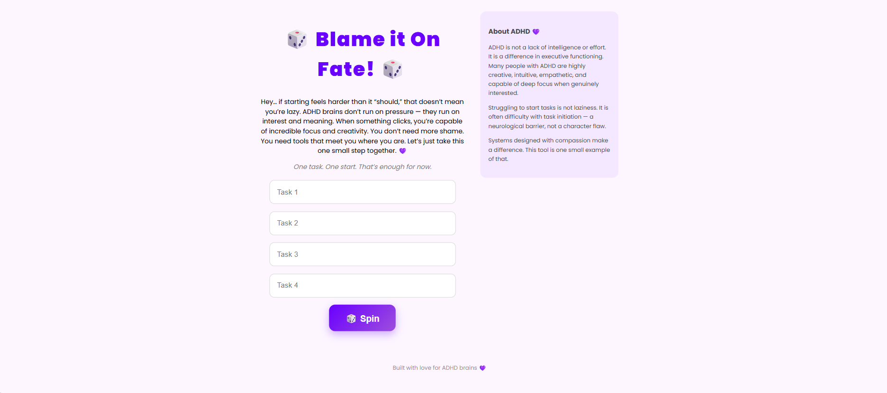
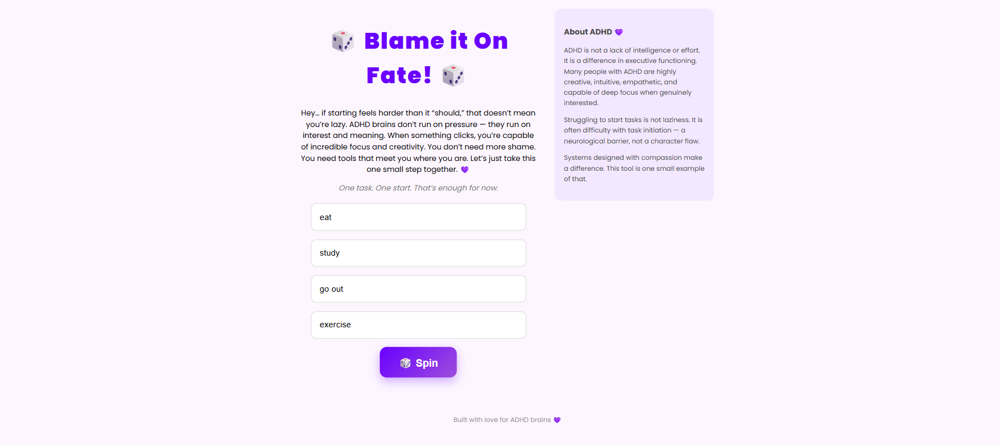
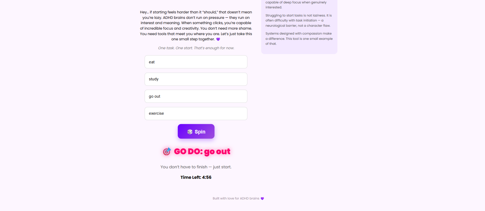
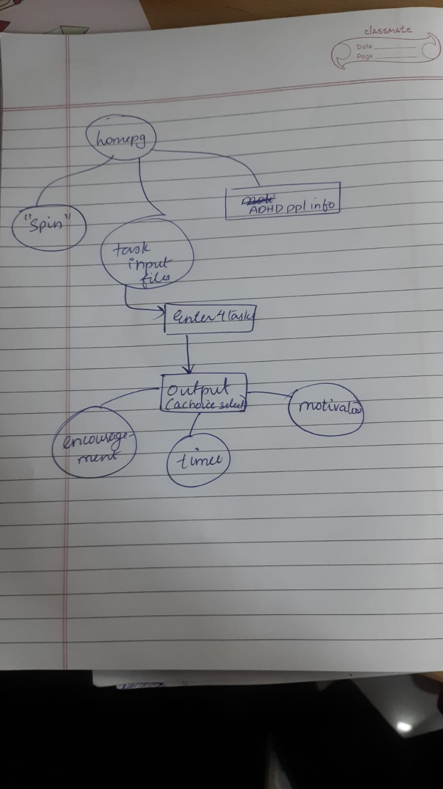

<p align="center">
  
</p>

# [Blame it on Fate!] 🎯

## Basic Details

### Team Name: [Leah]]

### Team Members
- Member 1: [Leah Sarah Biju] - [SNGCE,kadayiripu]


### Hosted Project Link
[mention your project hosted link here]

### Project Description
Blame it on fate! was built to address one specific struggle: starting. Many individuals with ADHD experience decision paralysis and executive dysfunction, making task initiation feel disproportionately difficult.

Instead of forcing choice, this tool removes it. Users enter a few tasks and spin to randomly select one turning avoidance into a game. The randomness reduces mental friction, lowers pressure, and encourages immediate action.

The app also integrates affirming messaging to promote self-understanding rather than shame. It’s not about fixing ADHD , it’s about designing systems that work with it.
### The Problem statement
Many people with ADHD struggle with starting tasks. When there are multiple things to do, choosing one can feel overwhelming. This often leads to decision paralysis and procrastination .

### The Solution
Blame it On Fate! solves this by removing the need to choose. Users enter a few tasks and spin to randomly select one. This reduces mental pressure and makes starting feel easier and more playful.

The app also includes supportive messages to encourage self-compassion and motivation, helping users feel understood rather than judged.

---

## Technical Details

### Technologies/Components Used

**For Software:**
- Languages used: html,css,java script

- Tools used: VS code


---

## Features

List the key features of your project:
- Feature 1: Users can enter multiple tasks and spin to randomly select one, reducing decision paralysis.
- Feature 2: The spinning animation makes task selection feel playful and engaging instead of stressful.
- Feature 3: Once a task is selected, a timer starts to encourage immediate action and short focus bursts.
- Feature 4: Displays supportive quotes and messages to promote self-compassion and confidence.

---

## Implementation

### For Software:

#### Installation
```bash
[Installation commands - e.g., npm install, pip install -r requirements.txt]
```

#### Run
```bash
[Run commands - e.g., npm start, python app.py]
```


## Project Documentation

### For Software:

#### Screenshots (Add at least 3)

!
The page to enter the choices.

!
The page where choices are entered.

!
The page where a choice is picked up and given to the user.

#### Diagrams

**System Architecture:**


Blame it On Fate! is a simple front-end web application built using HTML, CSS, and JavaScript.

HTML handles the structure (task inputs, spin button, result display).

CSS handles the styling and animations (spin effect, layout, design).

JavaScript handles the logic (random task selection, timer, motivational quotes).

All processing happens on the client side in the browser. There is no backend or database. User input is temporarily stored in memory while the app is running.

**Application Workflow:**


The user enters 3–4 tasks into the input fields.

The user clicks the Spin button.

JavaScript randomly selects one task.

The selected task is displayed with a dramatic animation.

A 5-minute focus timer starts automatically.

A motivational quote is displayed to encourage action.

This workflow reduces decision fatigue and encourages immediate task initiation through gamification.

---


## AI Tools Used (Optional - For Transparency Bonus)

If you used AI tools during development, document them here for transparency:

**Tool Used:** [ ChatGPT, Claude, Gemini]

**Purpose:** [What you used it for]
- Example: to get frontend code


**Percentage of AI-generated code:** [Approximately 70%]

**Human Contributions:**
- Architecture design and planning
- Integration and testing
- UI/UX design decisions

*Note: Proper documentation of AI usage demonstrates transparency and earns bonus points in evaluation!*


---

## License

This project is licensed under the [MIT] License - see the [LICENSE](LICENSE) file for details.


Made with ❤️ at TinkerHub
